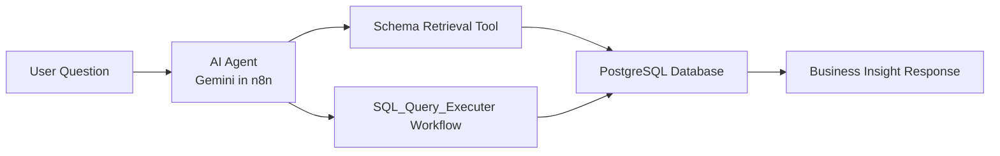

# AI SQL Analytics Agent

An AI-powered analytics assistant built using **n8n**, **Google Gemini**, and **PostgreSQL** that enables users to retrieve business insights using natural language instead of writing SQL queries.

The agent automatically understands user requests, retrieves database schema information, generates PostgreSQL queries, executes them, analyzes the results, and returns business-friendly insights.

---

## Demo

**Demo Video**

[Add Demo Video Link Here]

---

## Project Overview

Business users often need data insights but may not have the SQL skills required to query databases.

This project solves that problem by allowing users to ask questions in plain English while the AI agent handles the entire analytics workflow behind the scenes.

### Example

**User Question**

> Which campaign generated the highest sales volume?

**Agent Workflow**

1. Understand the request
2. Retrieve database schema
3. Generate SQL query
4. Execute query (directed to another workflow)
5. Analyze results
6. Return business insight

**Agent Response**

> The Diwali campaign generated the highest sales volume with 24,350 units sold during the campaign period.

---

## Architecture

---

## N8N Workflow

### Components

* AI Agent
* Google Gemini Chat Model
* PostgreSQL Database
* Schema Retrieval Tool
* SQL Query Executor Workflow
* Simple Memory

### Workflow Process

1. User submits a business question
2. Agent retrieves database schema
3. Agent determines user intent
4. Agent generates PostgreSQL query
5. Query is executed against PostgreSQL
6. Results are returned to the agent
7. Agent converts results into business-friendly insights

---

## Features

- Natural Language to SQL Conversion
- PostgreSQL Schema Discovery
- Dynamic SQL Query Generation
- Conversational Analytics
- Context-Aware Memory
- Clarification Questions for Ambiguous Requests
- Business-Friendly Insight Generation
- Read-Only Database Access
- Automated Workflow Orchestration using n8n

---

## Example Queries

### Example 1

**Question**

> Which campaign generated the highest sales volume?

**Response**

> The Diwali campaign generated the highest sales volume with 24,350 units sold.

---

### Example 2

**Question**

> Compare sales before and after promotion for the Diwali campaign.

**Response**

> Sales increased by 37% after the promotion compared to the pre-promotion period.

---

### Example 3

**Question**

> Which product category contributed the highest revenue?

**Response**

> Electronics generated the highest revenue, contributing ₹1.8M during the selected period.

---
## Tech Stack

| Component           | Technology                 |
| ------------------- | -------------------------- |
| Workflow Automation | n8n                        |
| LLM                 | Google Gemini              |
| Database            | PostgreSQL                 |
| Memory              | n8n Simple Memory          |
| Query Execution     | PostgreSQL                 |
| Prompt Engineering  | Custom SQL Analytics Agent |

---

## Challenges Faced

### Dynamic Schema Understanding

The agent needed to understand the database structure before generating SQL queries.

**Solution:**

Implemented a schema retrieval tool that dynamically fetches metadata from PostgreSQL and provides it to the AI Agent before query generation.

---

### Dynamic SQL Execution Based on User Context

One challenge was handling dynamically generated SQL queries based on varying user requirements.

The AI Agent could generate different SQL queries depending on the user's question, but executing these queries directly within the main workflow created limitations in maintaining flexibility and scalability.

**Solution:**

A separate workflow (`SQL_Query_Executer`) was created and exposed as a tool to the AI Agent.

The process works as follows:

1. The AI Agent interprets the user's request.
2. The Agent generates a PostgreSQL query dynamically.
3. The generated query is passed to a dedicated SQL execution workflow.
4. The execution workflow runs the query against PostgreSQL.
5. The results are returned to the Agent.
6. The Agent analyzes the results and provides a business-friendly response.

This modular design improved workflow maintainability, allowed dynamic query execution, and made the solution easier to extend for future enhancements.

---

### Handling Ambiguous User Requests

Users frequently ask broad questions that lack sufficient detail for accurate analysis.

**Solution:**

Implemented clarification logic that enables the AI Agent to ask follow-up questions until the analytical objective is clearly defined before generating SQL.

---
